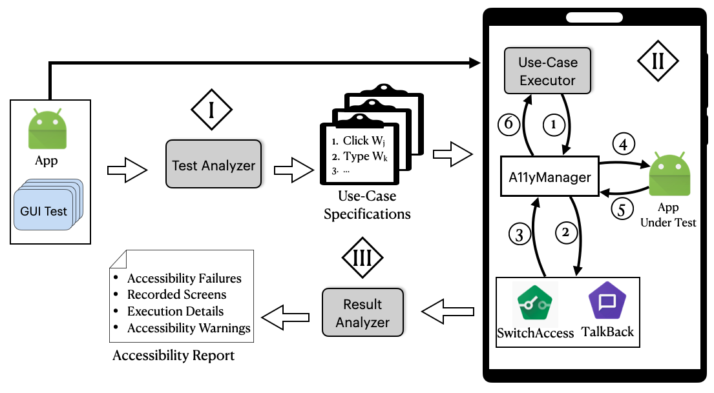

# Latte: Use-case and Assistive-Service Driven Automated Accessibility Testing Framework in Android

## Source Code

The source code of Latte can be found [here](https://drive.google.com/file/d/1_SAfUIVaEYfgSn_fx_jKjYYLQXwv_S2f/view?usp=sharing). It consists of several directories:

- Apps: APK files of apps under experiment
- Tests: The original test cases written for Appium testing framework
- UseCaseGenerator: The code corresponding to generating use cases from test scripts
- UseCases: The generated use cases 
- UseCaseExecutor: The code correspnding to executing use cases with an accessibility service.

## Approach

## Use-Case Executor

### Test Case (without any accessibility services)

<iframe width="560" height="315" src="https://www.youtube.com/embed/upTNw4MPdtY" frameborder="0" allow="accelerometer; autoplay; clipboard-write; encrypted-media; gyroscope; picture-in-picture" allowfullscreen></iframe>

### Use Case with TalkBack

<iframe width="560" height="315" src="https://www.youtube.com/embed/h3Wotx_St5o" frameborder="0" allow="accelerometer; autoplay; clipboard-write; encrypted-media; gyroscope; picture-in-picture" allowfullscreen></iframe>

## Accessibility Failure Examples

### Dynamic Layout

### TripIt

<iframe width="560" height="315" src="https://www.youtube.com/embed/fXU__XmTV4Q" frameborder="0" allow="accelerometer; autoplay; clipboard-write; encrypted-media; gyroscope; picture-in-picture" allowfullscreen></iframe>

### Navigation Loop

#### Geek 

<iframe width="560" height="315" src="https://www.youtube.com/embed/RYxSbBmoTBk" frameborder="0" allow="accelerometer; autoplay; clipboard-write; encrypted-media; gyroscope; picture-in-picture" allowfullscreen></iframe>

#### Calorie Counter

<iframe width="560" height="315" src="https://www.youtube.com/embed/N-P1GrMxmwU" frameborder="0" allow="accelerometer; autoplay; clipboard-write; encrypted-media; gyroscope; picture-in-picture" allowfullscreen></iframe>

## Non-Standard Implementation

### Yelp

<iframe width="560" height="315" src="https://www.youtube.com/embed/IwczdwkxFDs" frameborder="0" allow="accelerometer; autoplay; clipboard-write; encrypted-media; gyroscope; picture-in-picture" allowfullscreen></iframe>

### Feedly

<iframe width="560" height="315" src="https://www.youtube.com/embed/_6Zpy8Ff6lU" frameborder="0" allow="accelerometer; autoplay; clipboard-write; encrypted-media; gyroscope; picture-in-picture" allowfullscreen></iframe>

## Accessibility Warnings Examples

### Overlapping Layout

#### School Planner

<iframe width="560" height="315" src="https://www.youtube.com/embed/lV9in_-bjo8" frameborder="0" allow="accelerometer; autoplay; clipboard-write; encrypted-media; gyroscope; picture-in-picture" allowfullscreen></iframe>

### Far-off Widgets

#### TripIt

<iframe width="560" height="315" src="https://www.youtube.com/embed/_yi38_4nCv8" frameborder="0" allow="accelerometer; autoplay; clipboard-write; encrypted-media; gyroscope; picture-in-picture" allowfullscreen></iframe>

### Grid Layout

#### Todo List

<iframe width="560" height="315" src="https://www.youtube.com/embed/zocdYCii8qY" frameborder="0" allow="accelerometer; autoplay; clipboard-write; encrypted-media; gyroscope; picture-in-picture" allowfullscreen></iframe>

### Web View

#### Dictionary

<iframe width="560" height="315" src="https://www.youtube.com/embed/Ccjwx2_IGlI" frameborder="0" allow="accelerometer; autoplay; clipboard-write; encrypted-media; gyroscope; picture-in-picture" allowfullscreen></iframe>
